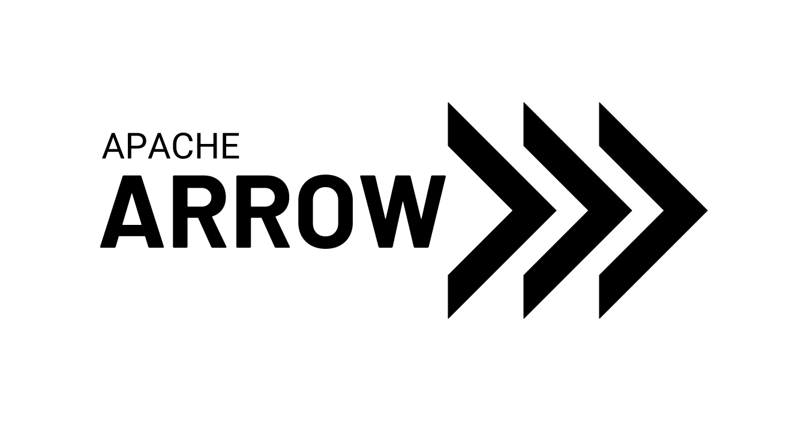

# Hey I'm Andreas (Andi) Schreiber
  
&nbsp; 📈 &nbsp;I'm a **Data Scientist & Engineer**  
&nbsp; 🐍 &nbsp;I'm a **Python Enthusiast**  
&nbsp; 💪 &nbsp;I'm very **passionate** about **fitness**  
&nbsp; 🙏 &nbsp;I'm **grateful** for the **Open-Source Community**

## Projects I'm currently working on:
* Serverless Cloud ETL with Azure
* Computer Vision with Tensorflow
* MLOps
* Async Crypto Data Harvest

## Technologies I'm using:
<table cellspacing="5" cellpadding="5" width="100%">
  <tr> 
    <td align="center">
      <a>
         Python
      </a>
    </td>
    <td align="center">
      <a>
         VS Code
      </a>  
    </td>
    <td align="center">
      <a>
         GitHub
      </a>  
    </td>
    <td align="center">
      <a>
         Docker
      </a>  
    </td>
    <td align="center">
      <a>
         Azure ML
      </a>  
    </td>
    <td align="center">
      <a>
         Functions
      </a>
    </td>
    <td align="center">
      <a>
         ADF
      </a>  
    </td>
    <td align="center">
      <a>
         PyArrow
      </a>  
    </td>
    <td align="center">
      <a>
         Parquet
      </a>  
    </td>
  </tr>
</table>

