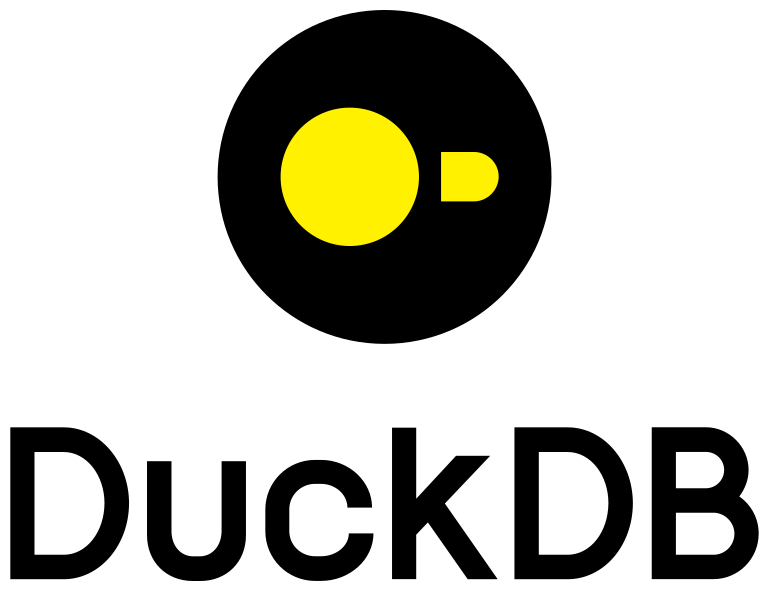
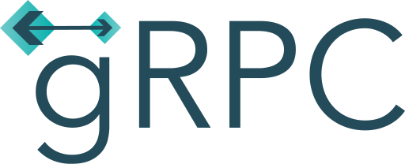

# Hey I'm Andi Schreiber

&nbsp; 📈 &nbsp;I'm a **Senior Lead Data Platform Architect**  
&nbsp; ⌨️ &nbsp;I'm coding in **Rust** and **Python**  
&nbsp; 💪 &nbsp;I'm very **passionate** about **fitness**  
&nbsp; 🙏 &nbsp;I'm **grateful** for the **Open-Source Community**

## Projects I'm currently working on:

* IoT Edge Device Microservice Application with Kubernetes
* Async Signal Dispatcher with Rust and gRPC (Tonic)
* Multi-Threaded Data Processing with Rayon and Polars
* Ephemeral Self-Hosted (Azure & On-Prem Kubernetes) Runners for GitHub Actions
* Kafka IoT Data Processing Simulation
* Computer Vision with PyTorch & OpenCV
* DevOps & MLOps

## Technologies I'm using:

<table cellspacing="5" cellpadding="5" width="100%">

  <tr> 
    <td align="center"><a> Rust</a></td>
    <td align="center"><a> Python</a></td>
    <td align="center"><a> VS Code</a></td>
    <td align="center"><a> GitHub</a></td>
    <td align="center"><a> Docker</a></td>
    <td align="center"><a> K8s</a></td>
    <td align="center"><a> Helm</a></td>
    <td align="center"><a> Harbor</a></td>
    <td align="center"><a> Racher</a></td>
  </tr>

  <tr></tr>

  <tr>
    <td align="center"><a> PyArrow</a></td>
    <td align="center"><a> Parquet</a></td>
    <td align="center"><a> Delta</a></td>
    <td align="center"><a> Iceberg</a></td>
    <td align="center"><a> PySpark</a></td>
    <td align="center"><a> Trino</a></td>
    <td align="center"><a> Dremio</a></td>
    <td align="center"><a> DuckDB</a></td>
    <td align="center"><a> Airflow</a></td>
  </tr>

  <tr></tr>

  <tr>
    <td align="center"><a> Kafka</a></td>
    <td align="center"><a> RabbitMQ</a></td>
    <td align="center"><a> Valkey</a></td>
    <td align="center"><a> Redis</a></td>
    <td align="center"><a> InfluxDB</a></td>
    <td align="center"><a> PostgreSQL</a></td>
    <td align="center"><a> Grafana</a></td>
    <td align="center"><a> Prometheus</a></td>
    <td align="center"><a> Loki</a></td>
  </tr>

  <tr></tr>
  
  <tr>
    <td align="center"><a> Alloy</a></td>
    <td align="center"><a> gRPC</a></td>
    <td align="center"><a> FastAPI</a></td>
    <td align="center"><a> Azure ML</a></td>
    <td align="center"><a> Functions</a></td>
    <td align="center"><a> ADF</a></td>
    <td align="center"><a> Azure ASP</a></td>
  </tr>

</table>