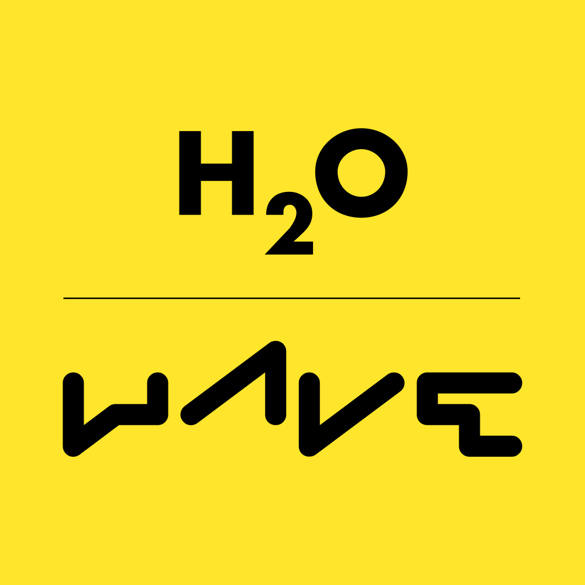

# Hey I'm Andreas (Andi) Schreiber
  
&nbsp; 📈 &nbsp;I'm a **Data Scientist & Engineer**  
&nbsp; ⌨️ &nbsp;I'm a **Python Enthusiast** and **Rust Apprentice**  
&nbsp; 💪 &nbsp;I'm very **passionate** about **fitness**  
&nbsp; 🙏 &nbsp;I'm **grateful** for the **Open-Source Community**

## Projects I'm currently working on:
* Kafka IoT Data Processing Simulation
* Multi-Threaded Data Processing with Rayon and Polars
* Serverless Cloud ETL with Azure
* Computer Vision with TensorFlow & OpenCV
* MLOps
* Ephemeral Self-Hosted (Azure) Runners for GitHub Actions
* Async Crypto Data Harvest

## Technologies I'm using:
<table cellspacing="5" cellpadding="5" width="100%">

  <tr> 
    <td align="center"><a> Python</a></td>
    <td align="center"><a> Rust</a></td>
    <td align="center"><a> VS Code</a></td>
    <td align="center"><a> GitHub</a></td>
    <td align="center"><a> Docker</a></td>
    <td align="center"><a> PySpark</a></td>
    <td align="center"><a> Kafka</a></td>
    <td align="center"><a> Delta Lake</a></td>
    <td align="center"><a> PyArrow</a></td>
  </tr>

  <tr></tr>

  <tr>
    <td align="center"><a> Parquet</a></td>
    <td align="center"><a> Azure ML</a></td>
    <td align="center"><a> Functions</a></td>
    <td align="center"><a> ADF</a></td>
    <td align="center"><a> FastAPI</a></td>
    <td align="center"><a> Flask</a></td>
    <td align="center"><a> Wave</a></td>
    <td align="center"><a> Azure ASP</a></td>
  </tr>

</table>

